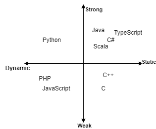

# [Robofriends App: React.js Advanced Hooks and Redux](https://jacobgrisham.github.io/React.js-Advanced-Hooks-and-Redux/)
[](https://jacobgrisham.github.io/React.js-Advanced-Hooks-and-Redux/)
[](https://app.circleci.com/pipelines/github/JacobGrisham/React.js-Advanced-Hooks-and-Redux)

[](https://gitmoji.dev)
## Coding project from the Udemy Course [The Complete Junior to Senior Web Developer Roadmap](https://www.udemy.com/course/the-complete-junior-to-senior-web-developer-roadmap/)


## 💡 Lessons Learned
- ES6 `map`
- Javascript Deconstructering
- Higher order functions
- React `Fragment`
- React `ErrorBoundary`
- React component nesting
- React folder organization
- Smart component (manages state) vs basic component
- Class stateful component vs functional stateful component
- React Hooks `useState` and `useEffect`
- Redux `connect` vs `useSelector` and `useDispatch`
- Redux middleware such as async actions using `redux-thunk` and logging using `redux-logger`
- Redux folder organization
- Website performance optimization using [WebPageTest](https://www.webpagetest.org/)
- React performance optimization using `React.memo`, `PureComponent`, and `shouldComponentUpdate`
- React debugging and performance optimization using Chrome Dev Tools Performace tab and React Developer Tools
- Route-based code splitting with `React.lazy()`
- Component-based code splitting with `react-loadable`
- [Emotion](https://emotion.sh/docs/introduction) for styling components
- Progressive Web Applications (PWA)
- Dynamic vs Static Typing and Weakly vs Strongly Typed
- Typescript commands `tsc name_of_file.ts` to run the Typescript compiler on the specified file, `tsc --init` to generate tsconfig.json file, and `tsc name_of_file.ts --watch` to enable hot-reloading for the specified file
- Typescript types: boolean, number, string, array, objects, null, undefined, tuple, enum, any, void, never, interface, function, classes, and union
- Refactoring applications with Typescript and using [DefinitelyTyped](https://definitelytyped.org/) to install the correct dependencies
- Refactoring Typescript into a Progressive Web Application that uses React and Redux
- Unit Tests, Integration Tests, Automation Tests

## 🤔 Senior Software Engineer Considerations
- ### Why Use React, What Came Before It?
  - Precursor was jQuery, which uses imperative programming.
  - The problem with jQuery is that tracking and managing DOM changes were difficult, causing development slowdown when apps grow.
  - React is the solution for the view layer (web, mobile, desktop, VR, etc.).
  - React organizes html, css, and javascript based on components, which allows for re-use in other parts of your app, more DRY code.
  - React has one-way data flow: only children are aware of changes, parents aren't bothered since it doesn't affect them, which helps to decrease bugs.
  - React employs the Virtual DOM: "React bot" creates javascript object and automatically makes efficient changes to the DOM based on our inputs. This increases the performance of the web page and decreases bugs.
  - Analogy: We are no longer the painter holding the brush, we are now the artist directing the machine. More specifically, no more `querySelectorAll`, `getElementById`, and creating numerous event handlers.
  - React has a strong ecosystem and developer community.
- ### Why use React Hooks, What Came Before It?
  - Stateful logic was bolted onto to the component. There was no way to (unscrew) abstract it and re-use it other components.
  - Lifecycle hooks within a component can grow to become unwieldy
  - Classes can increase the mental complexity since you have to track `this`, `this.state`
- ### Why use Redux?
  - Share data between containers more easily. In React, you have to move the state up one layer to share data between/among components.
  - Manage large applications with complex state. React was built to manage the view, Redux was built to manage state.
  - Predictable state management using 3 principles:
    - Single source of truth. Centralized place to manage state for entire application.
    - State is read-only/immutable. Prevent unexpected errors.
    - Changes are made using pure functions. More predictable input/output relationship
- ### What is Redux, What Came Before It?
  - 100's of Actions ==(middleware)==> 1 Reducer ====> 1 Store ==(React)==> Make Changes to DOM
  - jQuery was 1 Action ==> 1 Change in the DOM
  - Redux uses the Flux Pattern: Action --> Dispatcher --> Store --> View
  - Before the Flux Pattern was Model View Controller (MVC): Action --> Controller --> Many Models --> Many Views
- ### Performance Optimization
  - Front-end
    - Critical Render Path: use code splitting to stagger the timing that the files are sent to the client so as to reduce the initial loading time
    - Optimized Code: optimize for 'time to first meaningful paint' and 'time to interactive'
    - Progressive Web App
- ### How do Progressive Web Applications (PWA) Work, and Why Use It?
  - PWA's use registered service workers as network proxies, intercepting calls to network to determine if a call the call can be satisfied with the Cache Storage API
  - Optimize performance
  - Enable limited offline availability and interaction
  - Support similar native experiences on mobile and desktop

- ### Dynamic vs Static Typing, and What are their Strengths?
  - Static Typing requires declaring the 'type' of the variable explicitly (i.e. `int`, `float`, `char`, etc.)
  - Statically typed languages are self documenting, which helps avoid developer errors of using the wrong type. Statically typed languages are also self-testing, in that type errors surface during compilation instead of testing or in production
  - Dynamic Typing is not bound to a 'type'. Type checking is completed during runtime
  - Dynamically typed languages have a quicker developer learning curve, minimize code compliexity, and potentially allow for faster development

- ### Weakly Typed vs Strongly Typed, and What are their Strengths?
  - Weakly typed languages allow for more flexibility in interpreting types (i.e. type coercion, such as the concatenation of an integer and a string)
  - Strongly typed languages requires types to be compatible

- ### The Language Quadrant
  - 

- ### What is Typescript and Why Use It?
  - [Typescript](https://www.typescriptlang.org/) is a superset of Javascript that makes Javascript evolve from a weakly typed, dynamic language to a strongly typed, static language. A superset means that the new language is a layer around the older language, giving you more methods and rules.
  - The ideal environment to use Typescript has the following characteristics: desire for less bugs in production, desire for code to be self-documenting, have budget to train developers to use it, and can afford a slower development cycle.
  - There are a few alternatives for Javascript that are similar to Typescript: [flow](https://flow.org/), [Reason](https://reasonml.github.io/), and [elm](https://elm-lang.org/). However, the developer community is currently leaning towards Typescript. [As of 2020](https://insights.stackoverflow.com/survey/2020#technology-most-loved-dreaded-and-wanted-languages-wanted), Typescript is the second most loved language, and the fourth most wanted.

  - ### Unit Tests, Integration Tests, Automation Tests
    - **Unit Tests**: should cover all small, pure functions of an application. A pure function always has an input/outpu, doesn't affect another part of the program, and is deterministic (same input, same output). This is perhaps 90% of what you'll see. While building software, it's recommended to start here before moving on the other two test types.
    - **Integration Tests**: tests how different layers of the stack integrate or even how certain functions integrate with each other. Keep in mind that these tests are expensive in that they take a lot of energy think out, time to write, and may become obsolete when the code changes or a service is replaced. It's also hard to say when complete integration test coverage is achieved, since you can write near endless integration tests. You'll likely only see these tests in large companies with generous budgets and/or strong engineering teams.
    - **Automation (UI) Tests**: tests how the webpage behaves, often in a controlled environment (i.e. device screen size, specific browser, and specific browser version number). These tests are the most expensive in terms of time and money. Therefore, you'll likely only see these tests in large companies with generous budgets. Furthermore, these tests are the most infrequent, occuring before a release into production, once per week, or some other schedule. Can be completed manually by people and/or programmatically with code.
    Options for the former include:
      - In-house testing
      - Contractors
      - Test company service provider
    Options for the latter include:
      - [webdriver](https://webdriver.io/): good documentation
      - [testcafe](https://testcafe.io/): good starter, having all the tools in one (except cross-browser)
  
  - ### Testing Tools Matrix
  |Scaffolding|Assertion Library|Test Runner|Mock, Spies, Stubs|Code Coverage|
  |[jasmine](https://jasmine.github.io/)|jasmine|jasmine|jasmine|[istanbul](https://istanbul.js.org/)|
  |[jest](https://jestjs.io/)|jest|jest|jest|jest|
  |[mocha](https://mochajs.org/)|[chai](https://www.chaijs.com/)|mocha|[sinon](https://sinonjs.org/)|istanbul|
  |.|.|[karma](https://karma-runner.github.io/latest/index.html)|.|.|
    - **Mock**: fake a function or behavior, often used in integration tests
    - **Stubbing**: replaces selected functions with another function to ensure that the expected behavior happens, for example: faking a server to test an API call
    - **Spies**: provide information about functions (how many times they were called, in what cases, and by who)
    - karma runs tests in the browser, which is inefficient. There are two alternatives:
      - [Puppeteer](https://developers.google.com/web/tools/puppeteer), which is a headless browser, 
      - [jsdom](https://github.com/jsdom/jsdom), which mocks the javascript portion of the browser
    - React specific testing tools include jest snapshots and [Enzyme](https://enzymejs.github.io/enzyme/)

## 🚀 Getting Started

To run this project locally:
In your terminal, navigate to the root folder and run the following commands
```
$ npm install
$ npm start
```

## 📣 Reference
- Section 4: React + Redux + Module Bundling and Section 5: Performance Part 2 of the Udemy Course [The Complete Junior to Senior Web Developer Roadmap](https://www.udemy.com/course/the-complete-junior-to-senior-web-developer-roadmap/)